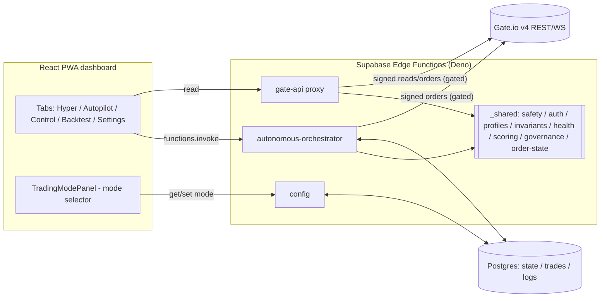
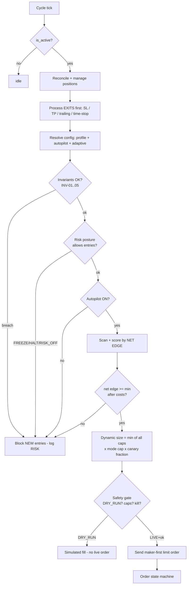
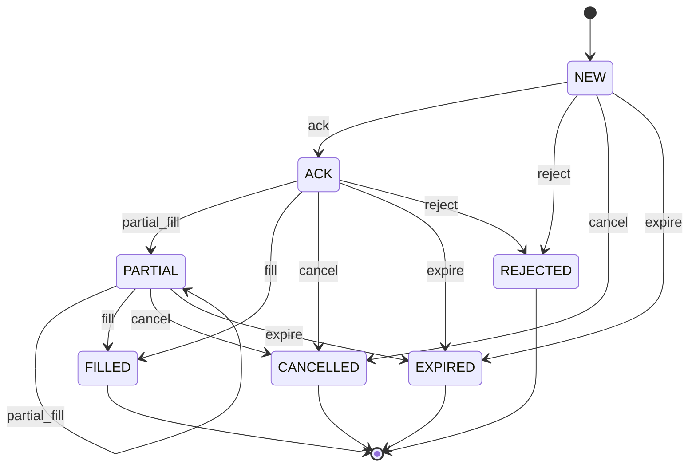
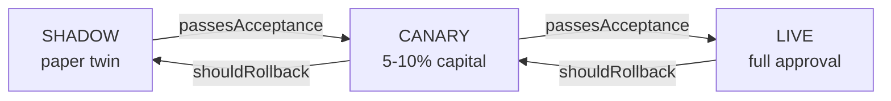

# Architecture Diagrams — flows, state machines, kill-switch ladder

> Text/Mermaid diagrams of the system. Renders on GitHub. Companions:
> [`ARCHITECTURE.md`](./ARCHITECTURE.md) · [`MASTER-SPEC.md`](./MASTER-SPEC.md).

## 1. System data flow



## 2. Autonomous cycle — decision flow (exits-first, gated)



## 3. Order state machine (`_shared/order-state.ts`)



Invalid events are safe no-ops (idempotent); terminal states ignore further
events; `remainingQty` drives exit logic on partial fills.

## 4. Kill-switch / risk-posture ladder (`_shared/health.ts`)

```
 NORMAL ──▶ RAISE_EDGE ──▶ MAKER_ONLY ──▶ RISK_OFF ──▶ FREEZE ──▶ HALT
   │            │              │             │            │          │
 trade      demand more     maker-only,   no new        no new     full
 normally   edge, fewer     exit faster   entries       entries    stop,
            positions                     (exits ok)    + reconcile reconcile
```
`riskPosture(KPIs)` takes the **most severe** trigger; `postureBlocksEntries()`
gates new entries. Underneath sits the owner-only **safety floor** (DRY_RUN,
caps, KILL_SWITCH, no leverage) which nothing auto-changes.

## 5. Governance promotion (`_shared/governance.ts`)


A candidate may only adjust **soft params**; promotion requires passing
acceptance tests (fill rate, slippage, drawdown, profit factor); any material
KPI degradation auto-rolls-back. Hard guardrails are never in scope.

## 6. Two-level + floor control summary

```
 [ is_active ]  AND  [ Autopilot ON ]  AND  [ invariants ok ]  AND  [ posture ok ]
        │                  │                      │                      │
        └──────────────── all true ──────────────┴──────────▶ may open NEW entries
                                                                     │
                              still passes ──▶ [ SAFETY FLOOR: DRY_RUN? caps? kill? ] ──▶ order
```
